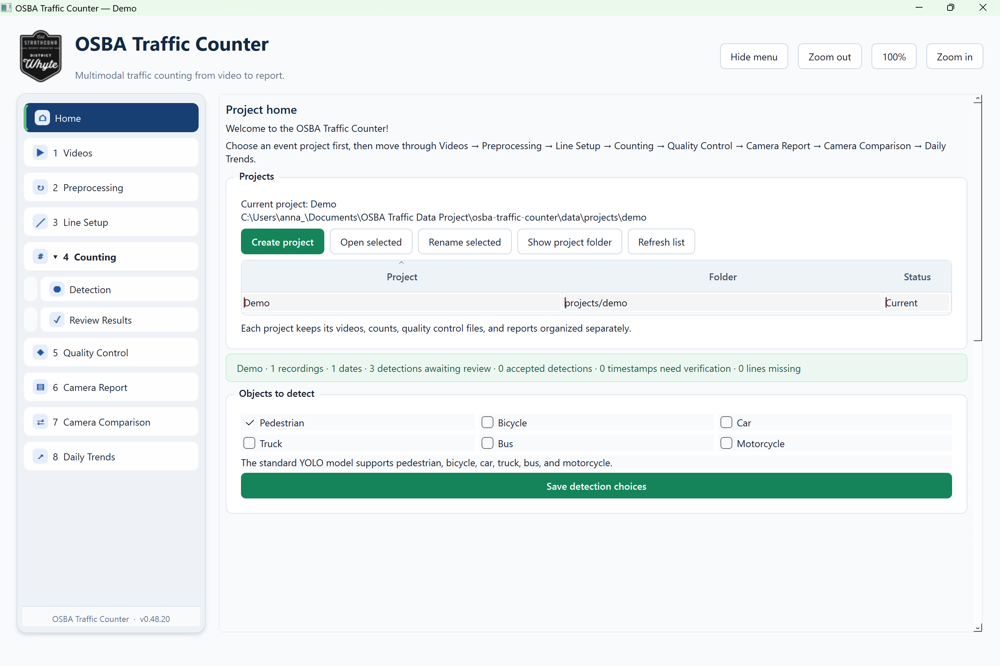

# 🚦 OSBA Traffic Counter

An end-to-end desktop application that transforms traffic-camera footage into validated multimodal traffic counts.

Built for the **Old Strathcona Business Association (OSBA)**, the application combines computer vision, data quality control, interactive review, and automated reporting in one reproducible workflow. It detects and tracks pedestrians, bicycles, cars, trucks, buses, and motorcycles, determines when they cross user-defined counting lines, and summarizes the results by direction, hour, camera, and date.

## 🎥 Application demo

[](https://www.youtube.com/watch?v=BRXLsiKIERQ)

**[Watch the full application demo on YouTube](https://www.youtube.com/watch?v=BRXLsiKIERQ)**

## 💡 Why I built it

Old Strathcona is both a major business and entertainment destination and a transportation corridor. People move through the district by walking, cycling, driving, and taking transit, but the OSBA did not have traffic data that fully captured this mix. Vehicle counts alone could not show the level of pedestrian activity in the area or how movement changed across locations, times, and event periods.

I built the OSBA Traffic Counter to automate the process of turning raw camera footage into reliable pedestrian, bicycle, and vehicle counts that can be compared across locations, times, and events. Developing this system required addressing several real-world data challenges:

- recordings were divided into irregular video fragments;
- cameras had different recording durations and missing periods;
- missing footage needed to remain distinguishable from zero traffic;
- each camera angle required configurable counting lines and directions;
- computer-vision detections needed quality control before reporting;
- results needed to be summarized clearly for non-technical users.

By bringing video processing, traffic counting, validation, analysis, and reporting into one application, the project gives the OSBA stronger evidence for event evaluation, district planning, business support, grant applications, and member advocacy.

## ✨ Key capabilities

### 👁️ Computer vision and tracking

- Runs YOLO object detection for six pedestrian and vehicle classes.
- Uses ByteTrack to maintain object identities across frames and short occlusions.
- Counts each tracked object once when it crosses a user-defined line.
- Determines Enter and Exit direction from the crossing geometry.
- Supports multiple counting lines in a single recording.
- Includes an optional perspective-corrected detection zone for small, distant objects.
- Uses CUDA and FP16 inference automatically when a compatible NVIDIA GPU is available.

### ✅ Data quality and validation

- Reads recording dates and start times from structured filenames instead of unreliable file metadata.
- Combines fragmented recordings in timestamp order while preserving original timing.
- Identifies recording gaps and inserts visible gap cards so missing footage is not reported as zero traffic.
- Provides optional detection snapshots for manual acceptance or rejection.
- Generates annotated quality-control videos showing detections, counting lines, directions, and running totals.
- Stores project settings, metadata, detections, review decisions, and validated counts in SQLite.

### 📊 Analytics and reporting

- Produces multimodal totals and Enter/Exit summaries by camera and date.
- Aggregates accepted crossings into hourly counts.
- Compares cameras using either total counts or counts per recorded hour.
- Visualizes daily trends by transportation mode and direction.
- Integrates historical weather context using Open-Meteo.
- Exports self-contained HTML reports for individual cameras, camera comparisons, and daily trends.

## 🔄 Application workflow

| Stage | Purpose |
|---|---|
| **Projects** | Create separate workspaces with independent SQLite databases and settings. |
| **Videos** | Import recordings, verify timestamps, and assign camera locations. |
| **Preprocessing** | Order fragments, identify missing intervals, and create combined daily videos. |
| **Line Setup** | Draw counting lines and define Enter and Exit directions. |
| **Detection** | Run YOLO and ByteTrack, detect line crossings, and save results. |
| **Review Results** | Inspect optional evidence snapshots and accept or reject detections. |
| **Quality Control** | Watch annotated videos and verify the final counts visually. |
| **Camera Reports** | Analyze one camera by class, direction, and hour. |
| **Camera Comparison** | Compare locations using totals, normalized rates, and hourly patterns. |
| **Daily Trends** | Examine changes across dates alongside weather conditions. |

## 🛠️ Technical design

| Component | Technology |
|---|---|
| Desktop interface | Python, PySide6, Qt |
| Object detection | Ultralytics YOLO |
| Multi-object tracking | ByteTrack |
| Video processing | OpenCV, FFmpeg |
| Data storage | SQLite |
| Reporting | HTML, CSS, embedded charts |
| Weather data | Open-Meteo API |
| Acceleration | PyTorch, CUDA, FP16 |

The application uses a modular `src` layout that separates the interface, processing pipeline, database operations, project management, video handling, analytics, and reporting. Long-running video tasks use worker threads so the desktop interface remains responsive, while batched inference and background writes improve throughput.

## 📁 Project structure

```text
src/traffic_reviewer/
├── app.py                 # Application entry point
├── processing.py          # Detection, tracking, and line-crossing pipeline
├── database.py            # SQLite schema and data access
├── combined_video.py      # Fragment joining and recording-gap handling
├── annotated_video.py     # Quality-control video generation
├── analytics.py           # Count aggregation and comparison logic
├── reporting.py           # HTML report generation
├── project_management.py  # Independent project workspaces
├── timestamping.py        # Filename-based date and time parsing
└── ui/                    # PySide6 interface and video players
```

## 🚀 Basic usage

1. Create a project and select the object classes to detect.
2. Import the video fragments and assign each recording to a camera.
3. Review recording coverage and build combined daily videos if needed.
4. Draw one or more counting lines and define their directions.
5. Run Detection using the recommended, fast, or maximum-accuracy mode.
6. Review saved evidence snapshots when manual validation is enabled.
7. Inspect the annotated video in Quality Control.
8. Generate camera, comparison, or daily-trend reports.

## 🔒 Privacy and repository scope

This repository contains application source code only. Traffic videos, project databases, detection evidence, model outputs, and generated reports are excluded from version control because they may contain sensitive information or large binary files.

## 👤 Author

**Anna Tam Ly**  
MSc in Modeling, Data and Predictions, University of Alberta
